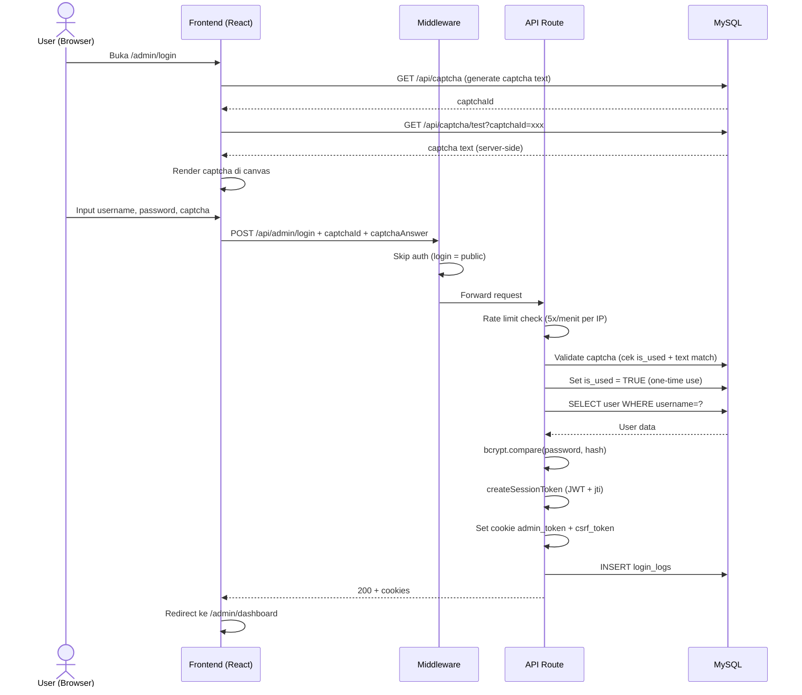
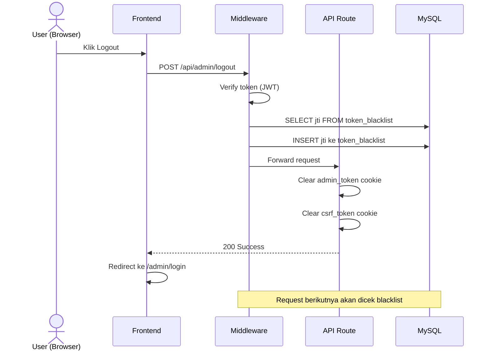
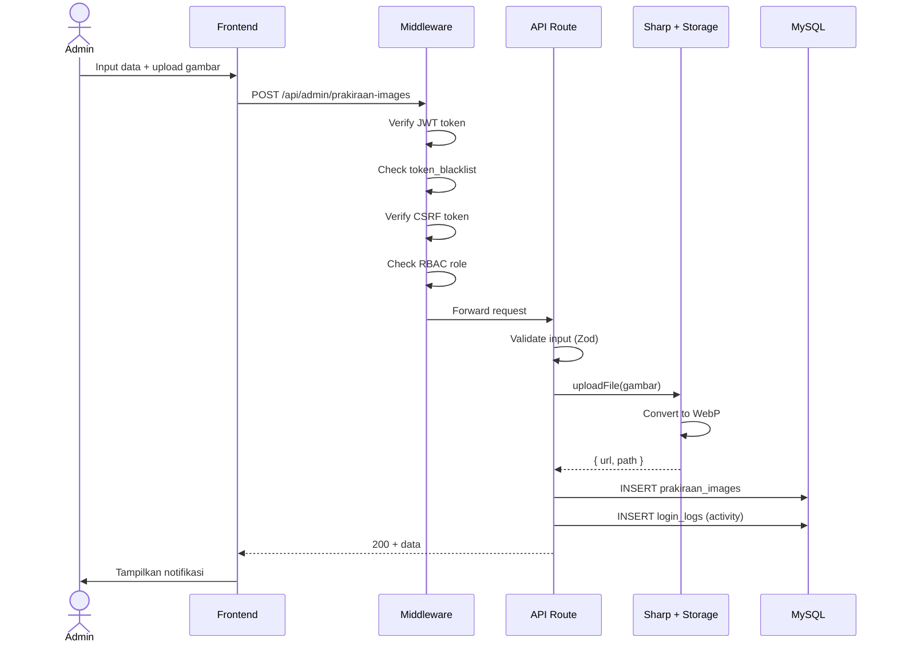
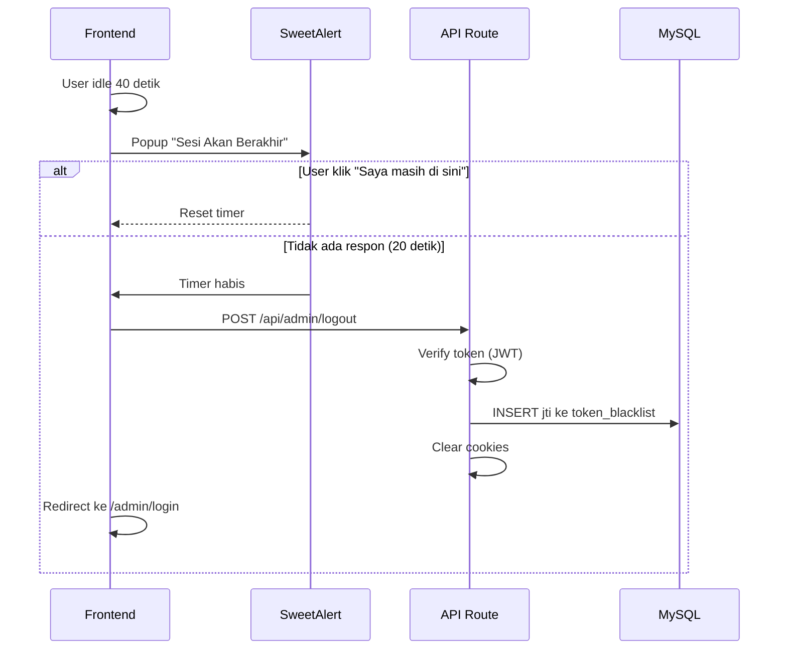
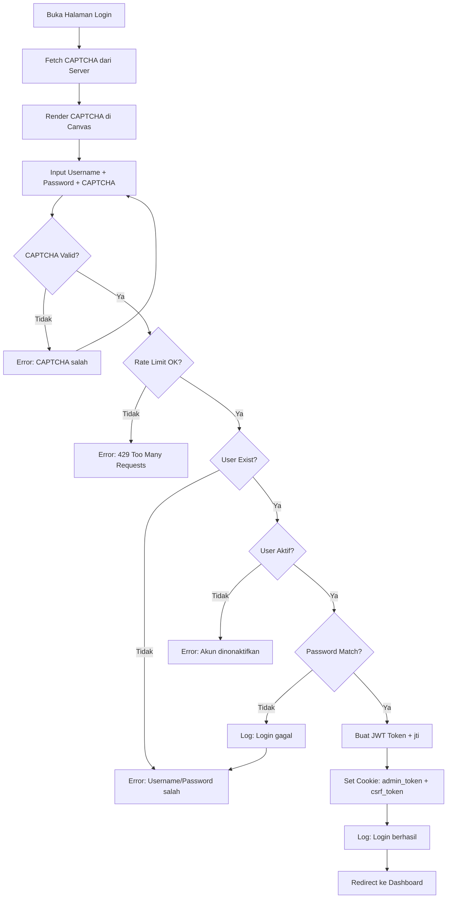
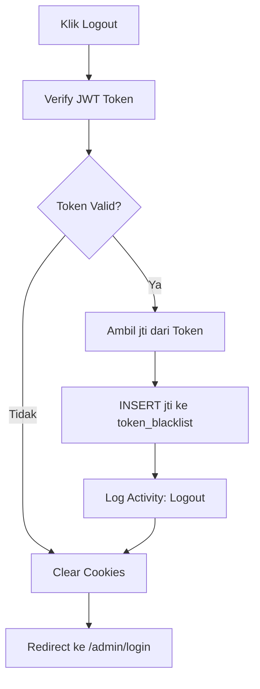
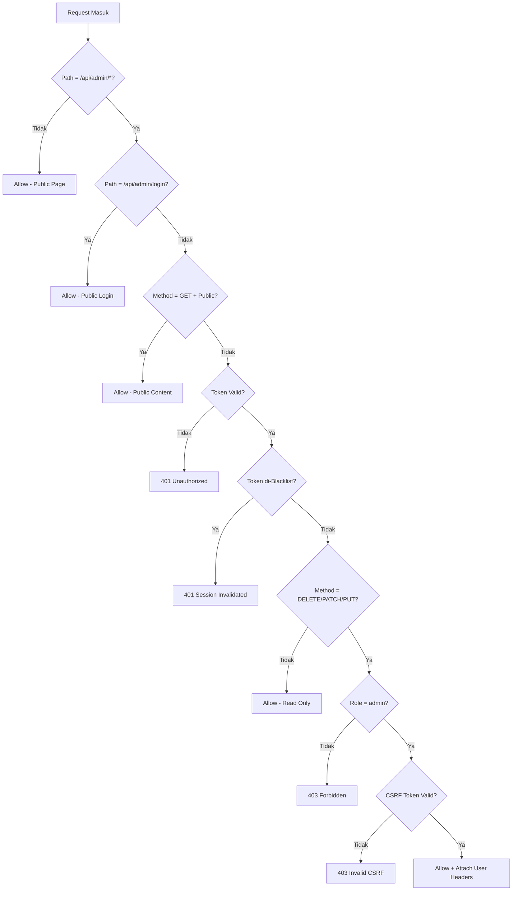
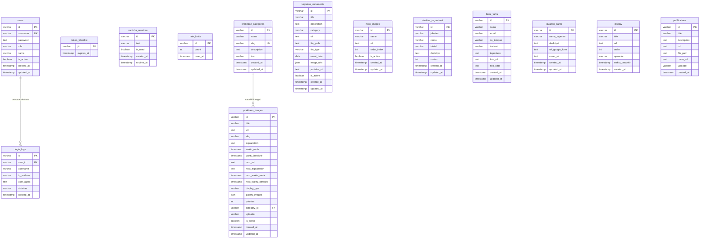

# Diagram Mermaid — BMKG Maritim Tegal Dashboard

Semua kode mermaid di bawah ini bisa langsung di-paste ke **draw.io** via **Extras → Edit Diagram → Advanced → Mermaid** atau **app.diagrams.net**.

---

## 1. Use Case Diagram

```mermaid
usecaseDiagram
    actor "Admin" as Admin
    actor "User" as User

    package "Dashboard Administrasi BMKG" {
        usecase "Login" as UC1
        usecase "Lihat Dashboard" as UC2
        usecase "Kelola Prakiraan Cuaca" as UC3
        usecase "Kelola Publikasi" as UC4
        usecase "Kelola Dokumentasi Kegiatan" as UC5
        usecase "Kelola Hero Slider" as UC6
        usecase "Kelola Struktur Organisasi" as UC7
        usecase "Kelola Layanan" as UC8
        usecase "Kelola Buku Tamu" as UC9
        usecase "Kelola Display Manager" as UC10
        usecase "Kelola Manajemen Pengguna" as UC11
        usecase "Lihat Riwayat Aktivitas" as UC12
        usecase "Pengaturan Akun" as UC13
        usecase "Logout" as UC14
    }

    Admin --> UC1
    Admin --> UC2
    Admin --> UC3
    Admin --> UC4
    Admin --> UC5
    Admin --> UC6
    Admin --> UC7
    Admin --> UC8
    Admin --> UC9
    Admin --> UC10
    Admin --> UC11
    Admin --> UC12
    Admin --> UC13
    Admin --> UC14

    User --> UC1
    User --> UC2
    User --> UC3
    User --> UC4
    User --> UC5
    User --> UC6
    User --> UC7
    User --> UC8
    User --> UC9
    User --> UC10
    User --> UC12
    User --> UC13
    User --> UC14
```

---

## 2. Sequence Diagram — Autentikasi Login (JWT + CAPTCHA Server-Side)



---

## 3. Sequence Diagram — Logout (Token Blacklist)



---

## 4. Sequence Diagram — CRUD Prakiraan (Create)



---

## 5. Sequence Diagram — Auto Logout



---

## 6. Activity Diagram — Proses Login



---

## 7. Activity Diagram — Proses Logout



---

## 8. Activity Diagram — RBAC Check



---

## 9. Entity Relationship Diagram (ERD)


